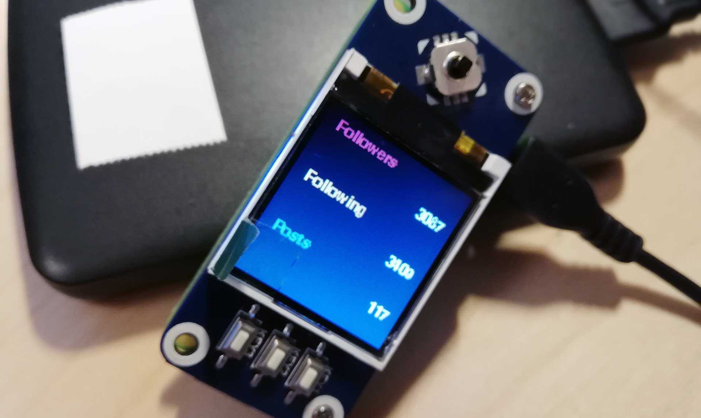

# Instagram Counter

For  Raspberry Pi Zero W & Waveshare 1.44" tft lcd HAT.

Basic python3 script to randomly fetch Instagram Followers, Following and Posts count every 10 to 20 minutes and displaying on a small TFT display.
Using request to fetch the page, Beautiful Soup for parsing and Pygame for the interface.

## How To

Information on how to install and configure the Waveshare 1.44" tft lcd HAT are in DOCS/SetupDisplayHowTo.md

Information on how to configure script launch on boot are in DOCS/SetupAutolaunch.md

## To do

- Fix Documentation. DUH.

- Move user name to external config file

- Add support for multiple users.
